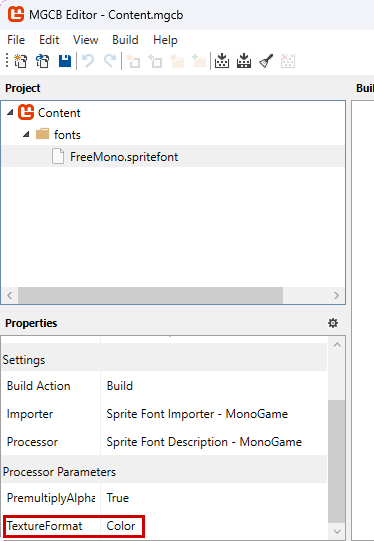

# GopherWood

This is a refactor of [willmotil's](https://github.com/willmotil/MonoGame-SpriteFont-HardEncoder-To-Class) excellent helper for hard-coding SpriteFonts into C#. This is helpful should you need a built-in default font in a library that isn't concerned with defining a content repository.

### Notes
An original warning of willmotil's is the following:
>"Be aware, I believe you should dispose the hard-coded result's texture in the Unload method of Game1, as this wouldn't have been loaded through the content manager.".

I would add that you might have better luck in general using monospaced fonts. Also, Texture.GetData<Color>() doesn't seem to be able to adjust its validation for SpriteFonts that have been compressed. I'd encourage you to set TextureFormat to "Color" in the configuration of the pipeline tool.

  

### Usage
Import the font like you would normally and then call the utility.

`SpriteFont font = Content.Load<SpriteFont>("fonts/MyFont");`

`SpriteFontHardCoder.Run(font, "MyFont", "C:/Users/myname/AppData/Local/MyApp");`

Then copy-and-paste the C# file that process wrote to the project you'll be consuming it. Correct the namespace it generated with to whatever is appropriate.
Now you can do the following:

`SpriteFont font = new MyFont().GetFont(GraphicsDevice);`
